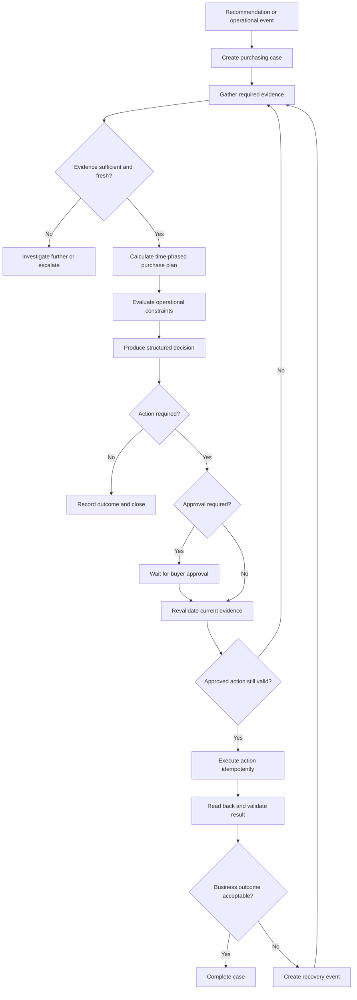
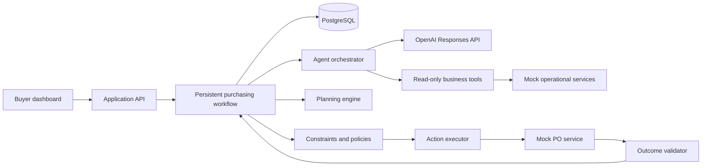

# AI Purchasing Agent

> Design baseline - v0.1

An explainable, constraint-aware purchasing agent for retail and quick-commerce operations. The system reviews purchasing recommendations, gathers operational evidence, makes a decision, executes an authorised action, and validates the real outcome.

This initial commit records the product and engineering approach before implementation begins. The design is expected to evolve as it is tested against concrete scenarios.

## Problem framing

A conventional replenishment system may recommend an action such as:

> Purchase 800 units of Product X for Fulfilment Node A.

That recommendation is an input, not a fact. It may have been produced from incomplete or outdated data and may no longer be appropriate when a buyer reviews it.

The AI Purchasing Agent independently investigates the situation and returns one of four decisions:

- `ACCEPT` - the original recommendation remains appropriate;
- `MODIFY` - purchasing is appropriate, but the quantity, supplier, date, or method should change;
- `REJECT` - the recommendation should not be executed;
- `INVESTIGATE_FURTHER` - a safe decision cannot be made with the available evidence.

The goal is not to build a chatbot that merely discusses purchasing. The goal is to demonstrate a system that can make, execute, and validate purchasing decisions while keeping a human in control of consequential actions.

## Product experience

A buyer works from an attention queue rather than an empty chat screen.

For each purchasing case, the buyer can see:

1. the original recommendation or operational event;
2. the evidence gathered by the agent;
3. data freshness, source, and any missing information;
4. the purchasing calculation and constraint results;
5. the agent's decision and important reasons;
6. the exact proposed action;
7. whether human approval is required;
8. the execution and validation timeline;
9. any recovery action proposed when reality differs from the plan.

The buyer supervises decisions and approves risk. They do not need to manually copy the recommended quantity into another system after approval.

## Core design principles

### 1. Recommendations are challenged

The agent never assumes that the upstream recommendation is correct. It reconstructs the purchasing position from current evidence.

### 2. AI orchestrates; deterministic code calculates

The LLM decides what to investigate, selects appropriate tools, identifies missing or conflicting evidence, and explains the result.

Regular application code performs inventory projections, purchasing calculations, constraint enforcement, approval checks, and exact post-action validation.

### 3. Evidence has provenance and freshness

Important facts are stored with their source and retrieval time. Missing, stale, or contradictory critical evidence leads to `INVESTIGATE_FURTHER`, not a fabricated assumption.

### 4. Approval is not blind execution

A buyer approves a specific version of an action proposal. Immediately before execution, the system reloads volatile data and recalculates the plan.

If the quantity, supplier, price, delivery date, or risk has materially changed, the old proposal is superseded and a new approval is required.

### 5. Success is a business outcome

An HTTP success response or a newly created PO row is not sufficient. The system reads the resulting PO back, checks its fields, obtains supplier confirmation, and recalculates the projected inventory outcome.

### 6. Every action is auditable and safe to retry

The system records evidence, calculations, decisions, approvals, action attempts, and validation results. Mutating operations use idempotency keys so retries or double-clicks cannot create duplicate purchase orders.

## Scenario 1 - Recommendation review

Scenario 1 will be implemented completely before broadening the system. Its implementation will use reusable domain concepts and workflow stages so that the remaining scenarios can be added without redesigning the application.

### Inputs required by the assignment

- current inventory;
- expected demand;
- existing open purchase orders;
- supplier lead time;
- supplier minimum-order requirements;
- available purchasing budget;
- available storage capacity.

### Additional evidence considered

- reserved, damaged, quarantined, and otherwise unusable inventory;
- forecast confidence, historical error, and bias;
- promotions, seasonality, and recent sales velocity;
- PO confirmation status and expected arrival date;
- supplier capacity and historical delivery reliability;
- order multiples, case packs, price breaks, and freight;
- shelf life and expiry risk;
- inter-node transfers and alternate suppliers;
- category-specific storage and inbound receiving capacity;
- timestamps and versions for all volatile information.

### Simplified purchasing calculation

```text
protection period
    = supplier lead time + time until the next purchasing review

target inventory
    = expected demand during the protection period + safety stock

inventory position
    = usable on-hand inventory
      + relevant confirmed inbound inventory
      - reservations and backorders

raw purchase requirement
    = max(0, target inventory - inventory position)
```

The raw requirement is then evaluated against MOQ, order multiples, supplier availability, budget, storage, shelf life, maximum stock cover, and delivery feasibility.

A day-by-day projected inventory balance will supplement the aggregate calculation so that a temporary stockout before the delivery date is not hidden by a healthy ending balance.

### Illustrative 800-unit case

The following values are mock data used to explain the intended behaviour; they are not hard-coded business rules.

| Input | Value |
| --- | ---: |
| Original recommendation | 800 units |
| Usable inventory | 200 units |
| Confirmed incoming PO | 300 units |
| Demand over the protection period | 900 units |
| Safety-stock target | 50 units |
| MOQ | 100 units |
| Order multiple | 50 units |
| Unit cost | INR 120 |
| Available budget | INR 70,000 |

```text
900 demand
+ 50 safety stock
- 200 usable inventory
- 300 confirmed incoming
= 450 units required
```

The agent should therefore return a structured `MODIFY` decision rather than blindly accepting 800:

```json
{
  "decision": "MODIFY",
  "originalQuantity": 800,
  "recommendedQuantity": 450,
  "confidence": "HIGH",
  "importantFactors": [
    "300 units are already on order",
    "450 units achieves the safety-stock target",
    "800 units creates avoidable excess",
    "MOQ, budget, and storage checks pass"
  ],
  "proposedAction": {
    "type": "CREATE_PURCHASE_ORDER",
    "quantity": 450
  },
  "requiresApproval": true
}
```

The application will calculate this response from scenario data. It will not contain special logic stating that 800 always becomes 450.

## End-to-end workflow



## Approval-time revalidation

The application will persist workflow state while waiting for a buyer. No server process or LLM request remains running during that time.

An action proposal includes:

- a proposal ID and version;
- the evidence snapshot used to create it;
- the exact proposed action;
- a calculation timestamp and validity window;
- the buyer and time associated with approval;
- an action fingerprint and idempotency key.

When the buyer approves:

1. the backend atomically claims the expected proposal version;
2. volatile data is retrieved again;
3. the deterministic plan and constraints are rerun;
4. the recalculated action is compared with the approved action;
5. unchanged actions may execute;
6. materially changed actions produce a new proposal version and require approval again.

The system must never silently change the approved quantity, supplier, price, delivery date, or spending commitment.

## Feedback and recovery loop

Validation occurs at three levels.

### Before execution

- evidence remains sufficiently fresh;
- the proposal version is current;
- the action still satisfies all constraints;
- no equivalent PO already exists;
- approval applies to the exact action payload.

### Immediately after execution

- the PO exists exactly once;
- product, node, supplier, quantity, price, and date match the approved action;
- budget and capacity effects were recorded correctly.

### After supplier response

- the confirmed quantity matches the requested quantity;
- the confirmed date still avoids a projected stockout;
- the updated purchasing plan remains acceptable.

If a supplier confirms only 300 of an approved 450 units, the validator emits a `SUPPLIER_SHORTFALL_REPORTED` event. That event is processed through the same workflow rather than hidden as a completed action.

## Extensibility across the four scenarios

The scenarios are event types, not four separate applications and not necessarily a fixed sequence.

| Event | Related scenario | Example response |
| --- | --- | --- |
| `PURCHASE_RECOMMENDATION_CREATED` | Scenario 1 | Review and challenge a proposed purchase |
| `SUPPLIER_SHORTFALL_REPORTED` | Scenario 2 | Re-source, transfer, defer, or escalate the missing quantity |
| `DEMAND_ANOMALY_DETECTED` | Scenario 3 | Recalculate coverage and revise the purchasing plan |
| `PURCHASE_CONSTRAINT_DETECTED` | Scenario 4 | Find a feasible alternative instead of bypassing the constraint |

All event types share a common lifecycle:

```text
TRIGGERED
  -> INVESTIGATING
  -> EVIDENCE_READY
  -> DECIDED
  -> AWAITING_APPROVAL
  -> REVALIDATING
  -> EXECUTING
  -> VALIDATING
  -> COMPLETED | RECOVERY_REQUIRED | ESCALATED
```

Scenario-specific modules determine required evidence, candidate actions, and success criteria. Evidence collection, calculations, policies, approvals, execution, audit, and validation remain shared.

## Responsibility boundaries

| Responsibility | LLM agent | Deterministic application | Buyer |
| --- | :---: | :---: | :---: |
| Identify evidence to investigate | Yes | Defines minimum requirements | No |
| Retrieve operational evidence | Orchestrates | Runs typed integrations | No |
| Calculate quantities and projections | No | Yes | No |
| Enforce hard constraints | No | Yes | No |
| Produce and explain the decision | Yes | Validates the schema | Reviews |
| Prepare an action plan | Yes | Validates policy and payload | Reviews |
| Authorise material spending | No | Enforces approval rules | Yes |
| Execute an authorised action | Orchestrates | Performs the write | No |
| Verify exact action results | Assesses context | Performs exact checks | Reviews exceptions |

The investigation agent will not receive an unrestricted purchase-order mutation tool. It produces a typed `ActionPlan`; the application validates and executes that plan only after policy and approval requirements are satisfied.

## Proposed architecture

The application will be a TypeScript modular monolith: one repository and one deployable application with explicit internal boundaries.



### Initial technology choices

| Concern | Choice |
| --- | --- |
| Language | TypeScript |
| Web application | Next.js and React |
| Backend endpoints | Next.js route handlers |
| Styling | Tailwind CSS and accessible UI components |
| Database | PostgreSQL |
| Database access | Drizzle ORM |
| Runtime schemas | Zod |
| LLM integration | OpenAI Responses API using the official JavaScript SDK |
| Model | Configurable through `OPENAI_MODEL`; initial target `gpt-5.4-mini` |
| Unit and integration tests | Vitest |
| Browser tests | Playwright |
| Local infrastructure | Docker Compose for PostgreSQL |

The direct OpenAI SDK is preferred over a heavyweight agent framework for the first implementation. A small, explicit orchestration loop will be easier to understand, trace, test, and modify during an interview discussion.

## Planned module boundaries

```text
src/
├── app/                  # Pages and HTTP endpoints
├── domain/               # Cases, evidence, decisions, actions, validation
├── agent/                # Prompts, tool schemas, and orchestration
├── planning/             # Inventory projection and replenishment calculations
├── constraints/          # Budget, storage, supplier, MOQ, and shelf-life rules
├── policies/             # Freshness, material-change, and approval policies
├── workflows/            # Persistent case-state transitions
├── integrations/         # Mock operational-system adapters
├── db/                   # Schema, migrations, and seed data
└── evaluation/           # Scenario fixtures, assertions, and runner
```

This is a direction rather than a requirement to create unnecessary abstractions. The first implementation will stay small while preserving these responsibility boundaries.

## Evaluation strategy

The evaluation will assert the complete decision trajectory, not only the final prose response.

Initial Scenario 1 cases will cover:

1. accept a correct recommendation;
2. modify a recommendation because confirmed inbound supply already exists;
3. reject a recommendation when no additional stock is required;
4. investigate further when critical data is missing or stale;
5. adjust for MOQ or order-multiple rules;
6. handle budget and storage constraints;
7. account for expiry risk;
8. invalidate a proposal when data changes before approval;
9. prevent duplicate PO creation during retries;
10. enter recovery when the supplier confirms less than requested.

Each case should verify:

- the required information was obtained;
- freshness and evidence sufficiency were checked;
- calculations were correct;
- constraints were respected;
- the correct decision category was returned;
- approval policy was followed;
- the appropriate action was taken;
- the resulting business state was validated;
- failed or unexpected outcomes entered recovery safely.

## Implementation plan

1. Establish the domain model and persistent workflow states.
2. Create mock operational data and typed read APIs.
3. Implement the deterministic planning and constraint engines.
4. Implement Scenario 1 evaluations without the LLM.
5. Add the LLM investigation and explanation layer.
6. Build the buyer case and approval experience.
7. Add idempotent PO execution and post-action validation.
8. Demonstrate Scenario 1 transitioning into a supplier-shortfall recovery case.
9. Complete documentation, architecture, setup instructions, and demo guidance.

## Current status

Planning and architecture baseline only. Application implementation has not started.

Setup and run instructions will be added as the executable project is introduced in subsequent commits.

## Security

- API keys and secrets will never be committed.
- LLM credentials will remain server-side.
- Required environment variables will be documented in `.env.example`.
- All action attempts and approval decisions will be auditable.
- Mock services will be used for external operational systems.

## Design status

This README is intentionally versioned through Git history. Future commits will update it as assumptions are tested and implementation decisions become concrete.
