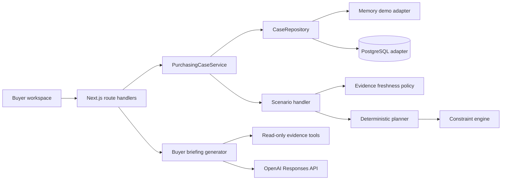

# Architecture and safety model

## System shape

The project is a TypeScript modular monolith. That gives the interview implementation one deployable unit while keeping the boundaries that would become services in a larger system.



The important dependency direction is inward: Next.js and database adapters depend on the workflow/domain layers. Replenishment rules do not depend on UI, HTTP, PostgreSQL, or an LLM.

## Scenario 1 execution sequence

```mermaid
sequenceDiagram
    participant S as Recommendation system
    participant W as Purchasing workflow
    participant E as Evidence adapters
    participant P as Planner and policies
    participant B as Buyer
    participant O as PO service

    S->>W: PURCHASE_RECOMMENDATION_CREATED (800 units)
    W->>E: Read inventory, demand, POs, supplier, budget, storage
    E-->>W: Versioned evidence with source and observedAt
    W->>P: Validate freshness and calculate plan
    P-->>W: MODIFY to 450 + constraint results
    W-->>B: Proposal v1 for exactly 450 units
    Note over W,B: Workflow state is persisted; no request remains running
    B->>W: Approve proposal v1
    W->>E: Refresh volatile evidence
    W->>P: Recalculate and compare action fingerprint
    alt Material change
        P-->>W: New action, for example 350 units
        W-->>B: Supersede v1; request approval for v2
    else Unchanged
        W->>O: Create PO with idempotency key
        O-->>W: PO record
        W->>O: Read back PO
        W-->>B: Exact fields validated; case completed
    end
```

## Trust boundaries

### Deterministic application

Application code owns:

- usable inventory and inventory-position calculations;
- protection period, target, raw requirement, and projections;
- MOQ and order-multiple handling;
- budget, storage, supplier-capacity, and expiry limits;
- evidence freshness and material-change policies;
- approval/version checks, idempotency, execution, and exact validation.

### LLM boundary

The optional model receives:

- results from eight named read-only evidence adapters;
- the already-computed deterministic plan and decision;
- the exact proposal metadata.

It returns a Zod-validated Structured Output containing a concise buyer briefing. The prompt explicitly forbids recalculating or changing the action. It has no purchase-order write tool and its output never bypasses workflow policy.

### Human boundary

The buyer approves one proposal version and exact action payload. Approval authorises an attempt subject to immediate revalidation; it does not authorise the software to silently substitute a new quantity, supplier, price, or delivery date.

## Persistence and concurrency

`CaseRepository` has two implementations:

- `MemoryCaseRepository` makes the demo require only Node.js;
- `PostgresCaseRepository` stores the complete case aggregate in JSONB alongside indexed lifecycle fields.

PostgreSQL rows carry a monotonically increasing `revision`. Mutations use optimistic compare-and-swap updates, so concurrent requests cannot silently overwrite each other. Action proposals contain:

- proposal ID and version;
- evidence versions;
- validity window;
- SHA-256 action fingerprint;
- idempotency key derived from case, version, and fingerprint.

## Failure and recovery behavior

| Failure | Behavior |
| --- | --- |
| Missing, invalid, or stale critical evidence | `INVESTIGATE_FURTHER`; no action proposal |
| Hard constraints cannot support MOQ | `INVESTIGATE_FURTHER`; no write tool is exposed |
| Live action differs after approval | Old proposal superseded; fresh approval required |
| Approval retry or double-click | Same idempotency key; same PO returned |
| Created PO differs from approved action | `RECOVERY_REQUIRED` |
| Supplier confirms fewer units | `SUPPLIER_SHORTFALL_REPORTED` recovery event |
| OpenAI key/API/schema unavailable | Deterministic briefing fallback; decision unaffected |

## Extending Scenarios 2–4

New scenarios should implement an event handler that declares required evidence, candidate actions, and validation criteria. They reuse the same case lifecycle, repositories, evidence envelopes, approval policy, proposal versioning, executor, timeline, and recovery semantics.

Likely additions are:

- Scenario 2: alternate supplier, transfer, and split-order candidate generation;
- Scenario 3: demand-anomaly evidence and forecast override policy;
- Scenario 4: constraint-collision resolution and explicit infeasibility explanations.
